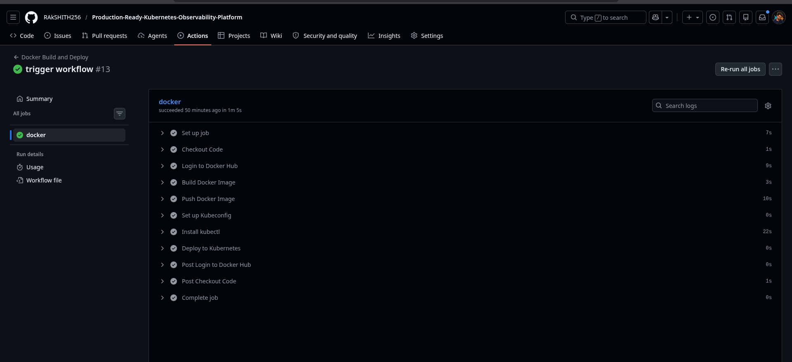
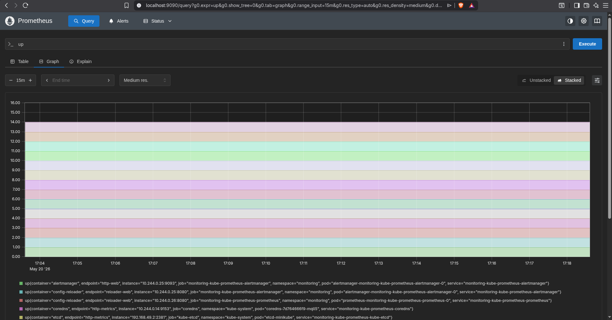
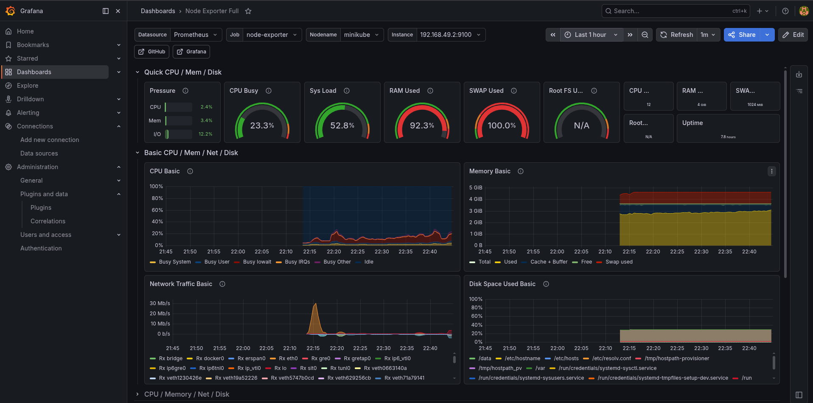
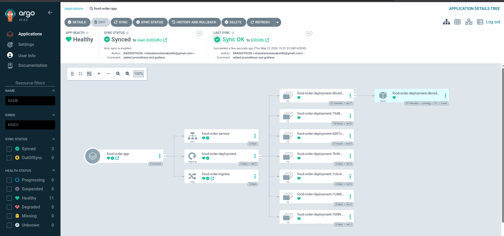

# Production-Ready Kubernetes Observability & GitOps Platform 🚀

A complete cloud-native DevOps project demonstrating CI/CD automation, Kubernetes orchestration, GitOps deployment strategy, monitoring, and observability using modern industry-standard tools.

---

# 📌 Project Overview

This project demonstrates a production-style DevOps workflow where application code is automatically built, containerized, deployed, synchronized, and monitored using Kubernetes and modern observability tools.

The platform integrates:

- CI/CD automation
- Docker containerization
- Kubernetes orchestration
- GitOps deployment using ArgoCD
- Monitoring using Prometheus
- Visualization using Grafana
- Real-time infrastructure observability
- Self-hosted GitHub Actions runner

---

# 🏗️ Architecture

Developer Push  
↓  
GitHub Actions CI Pipeline  
↓  
Docker Image Build  
↓  
Docker Hub Push  
↓  
ArgoCD GitOps Sync  
↓  
Kubernetes Deployment  
↓  
Prometheus Monitoring  
↓  
Grafana Dashboards  

---

# ⚙️ Tech Stack

## DevOps & CI/CD
- Git
- GitHub
- GitHub Actions
- Self-hosted Runner

## Containerization
- Docker
- Docker Hub

## Orchestration
- Kubernetes
- Minikube

## GitOps
- ArgoCD

## Monitoring & Observability
- Prometheus
- Grafana
- kube-state-metrics
- Node Exporter

## Package Management
- Helm

## Operating System
- Linux (Fedora)

---

# 🚀 Features

✅ Automated CI Pipeline using GitHub Actions  
✅ Self-hosted GitHub Runner  
✅ Dockerized Application Deployment  
✅ Kubernetes Orchestration  
✅ GitOps Workflow using ArgoCD  
✅ Automatic Kubernetes Synchronization  
✅ Prometheus Metrics Collection  
✅ Grafana Monitoring Dashboards  
✅ Real-time Infrastructure Monitoring  
✅ Kubernetes Observability Platform  
✅ Drift Detection & Self-Healing  
✅ Deployment Rollback Capability  

---

# 🔄 CI/CD + GitOps Workflow

## Continuous Integration (CI)

1. Developer pushes code to GitHub
2. GitHub Actions pipeline triggers automatically
3. Docker image is built
4. Docker image is pushed to Docker Hub

## GitOps Continuous Deployment (CD)

1. ArgoCD continuously watches GitHub repository
2. Detects manifest changes automatically
3. Synchronizes Kubernetes cluster state
4. Deploys updated application automatically
5. Maintains desired state consistency

---

# 🔥 Why ArgoCD (GitOps)?

Traditional deployments use push-based deployments where CI pipelines directly access Kubernetes clusters.

This project uses a modern GitOps approach where:

- Git becomes the single source of truth
- ArgoCD continuously reconciles cluster state
- Drift detection automatically corrects manual changes
- Kubernetes deployments become declarative and self-healing

---

# 📊 Monitoring Stack

## Prometheus
Used for:
- Metrics collection
- Kubernetes monitoring
- Pod monitoring
- Node monitoring
- Resource analysis

## Grafana
Used for:
- Dashboard visualization
- CPU/RAM analysis
- Network traffic analysis
- Infrastructure observability
- Kubernetes monitoring dashboards

---

# 📈 Metrics Monitored

- CPU Usage
- Memory Usage
- Network Traffic
- Disk Usage
- Kubernetes Pod Health
- Node Health
- Deployment Status
- Replica Health
- Cluster Resource Usage

---

# 📷 Project Screenshots

## GitHub Actions CI Pipeline

---

## Prometheus Monitoring Dashboard

---

## Grafana Infrastructure Dashboard

---

## ArgoCD GitOps Dashboard

---

# 🧠 Key DevOps Concepts Implemented

- CI/CD Automation
- GitOps Workflow
- Infrastructure Observability
- Kubernetes Orchestration
- Continuous Reconciliation
- Drift Detection
- Self-Healing Infrastructure
- Rolling Deployments
- Containerization
- Monitoring & Alerting Foundations

---

# 🔮 Future Enhancements

- Loki + Promtail Logging
- Terraform Infrastructure as Code
- Trivy Security Scanning
- Alertmanager Integration
- AWS EKS Deployment
- Horizontal Pod Autoscaling (HPA)
- RBAC & Kubernetes Security
- OpenTelemetry
- Distributed Tracing
- DevSecOps Pipeline

---

# 🎯 Learning Outcomes

Through this project, I gained practical hands-on experience with:

- Kubernetes Administration
- GitOps using ArgoCD
- CI/CD Automation
- Docker Containerization
- Observability & Monitoring
- Infrastructure Automation
- Prometheus & Grafana
- GitHub Actions
- Self-hosted Runners
- Kubernetes Resource Management
- Production-style DevOps Workflows

---

# 👨‍💻 Author

Rakshith C

DevOps | Kubernetes | GitOps | Observability | Cloud-Native Technologies
